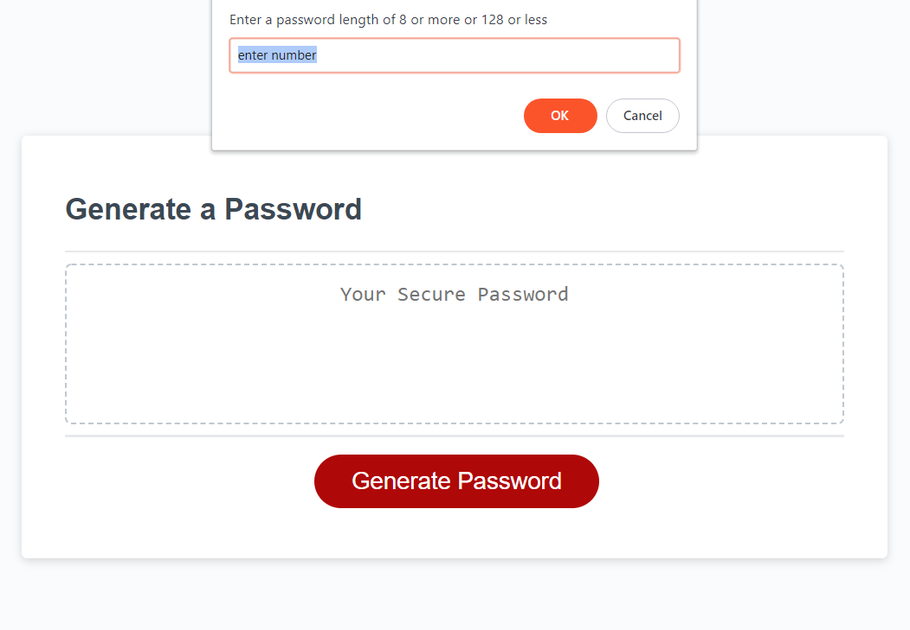

# password-generator

## Description

In order to be most secure, a password needs to be long and contain a variety of characters. This application generates a string of characters given the parameters which the user inputs.

## Installation

n/a

## Usage

click on "Generate Password" and answer all the prompts. A string will appear in the center box 

https://brendanshelton.github.io/password-generator/

## Technologies used

HTML, CSS, Javascript

## Credits

n/a

## License

The last section of a high-quality README file is the license. This lets other developers know what they can and cannot do with your project. If you need help choosing a license, refer to [https://choosealicense.com/](https://choosealicense.com/).
